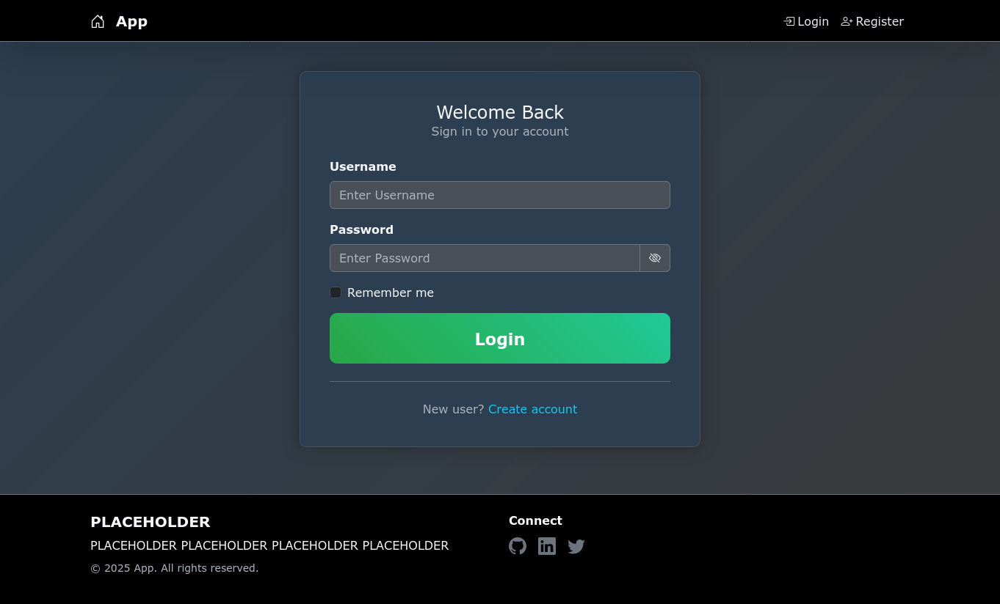
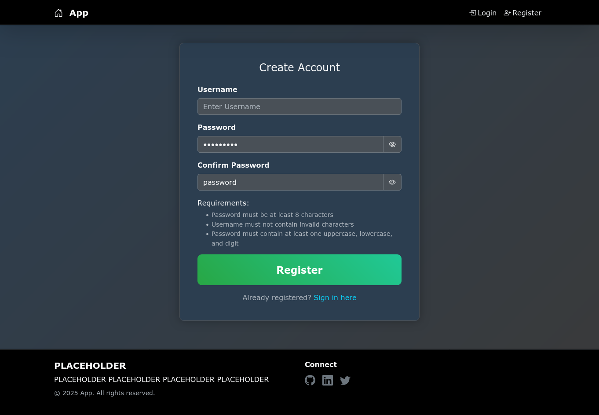

# Django Authentication Example
[](https://skillicons.dev)

Simple implementation of user authentication using Django as backend.

## Features
- User registration and login
- Session-based authentication (Django’s default)

## Installation
```bash
git clone https://github.com/njustinbunos/Django-Authentication.git
cd Django-Authentication
# Optional: Create and activate a virtual environment
# python3 -m venv venv
# activating a venv is different for Windows, MacOS, and Linux so just look it up for your OS
cd mysite
pip install -r requirements.txt
python manage.py migrate
python manage.py runserver
```

## Screenshots




